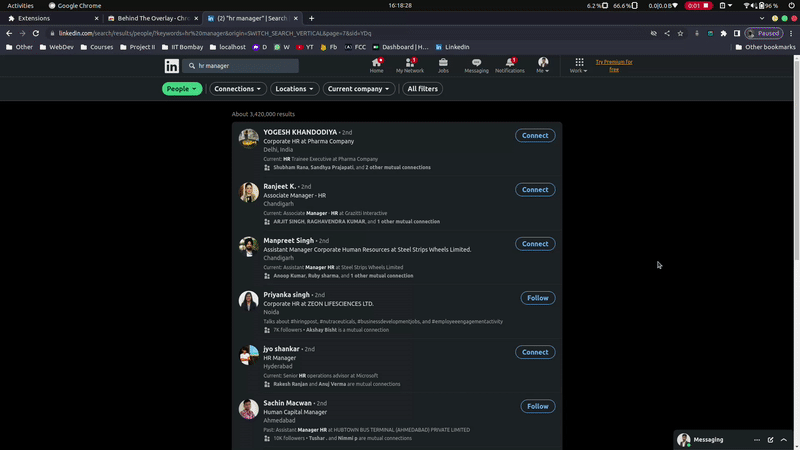
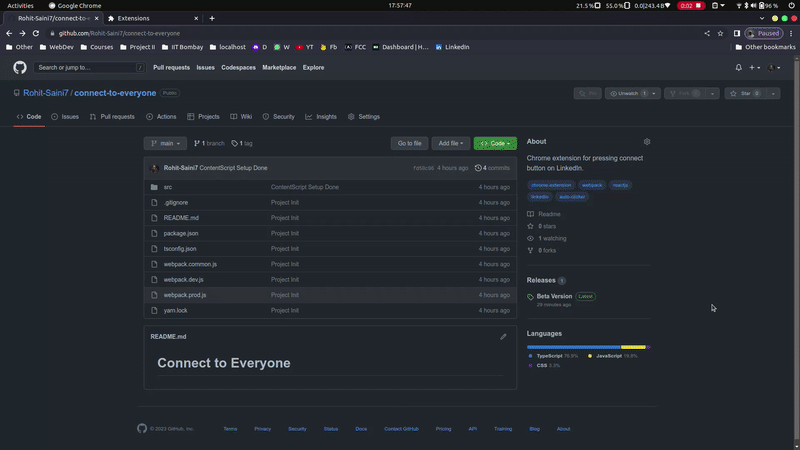

## Connect to Everyone

- This is a Chrome Extension, used to click "Connect" button on [Linkedin.com](https://linkedin.com), with a random delay of 5-10 seconds.s
- It automatically clicks on "Send" button as well if a popup appears after clicking "Connect" button.

## In Action

## How to Install

1. Download the [CRX file](https://github.com/Rohit-Saini7/connect-to-everyone/releases/download/v1.0.0/v1.0.0.crx) to your computer.
2. Change downloaded file's extension from `.crx` to `.zip` and unzip the file.
3. Go to [Extensions Page](chrome://extensions/) in `Chrome` and check the box for Developer mode in the top right corner.
4. Click the `Load unpacked` button in left corner and select the unzipped folder to install the Extension.
5. Installation is done, Star github repo of you like the extension.

## Tech Stack

- Dependencies

  - React
  - React Dom
  - Styled Components

- Dev Dependencies

  - TypeScript & Types

    - @types/chrome
    - @types/react
    - @types/react-dom
    - @types/styled-components

  - Webpack and components

    - webpack
    - webpack-cli
    - webpack-merge

  - Loaders for Webpack

    - css-loader
    - style-loader
    - ts-loader

  - Others

    - copy-webpack-plugin
    - html-webpack-plugin
